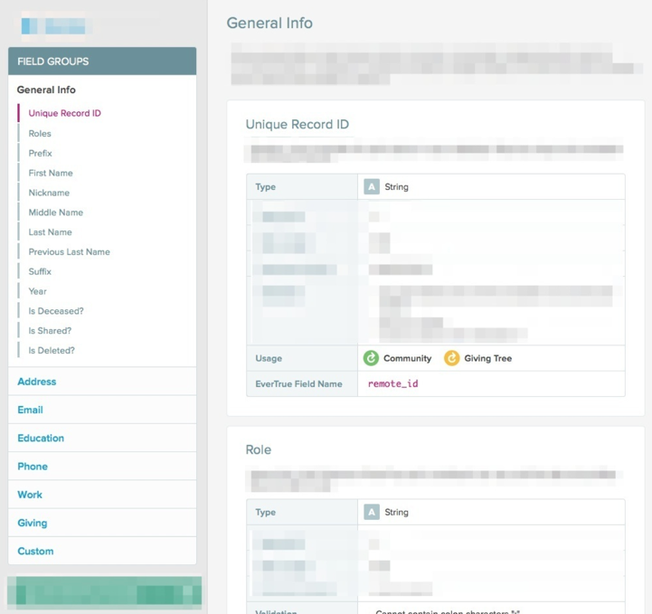

# Frontend Assessment
We look more at code quality & data manipulation versus design details. 

Use HTML, CSS and JavaScript these tasks. You can use any JS framework or CSS library or preprocessor.

# Task
Use the file `schema.json` to create an interactive page. 
Requirements:
* Display the data from the file grouped into sections as a side navigation menu. 
* When an item in the menu is clicked, display the details of that property on the page. 
* Click on the group in the menu, expand menu, and change the main section to display all properties in that group
* Click on sub-element in the menu and navigate to the details in the main section for that property

### Note
This UI was built for a real feature at EverTrue and below is a screenshot for reference. We don't expect it to be that complete.

